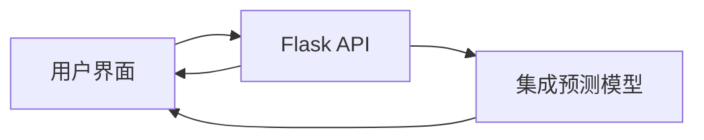

# 基于神经网络集成学习的心血管疾病风险预测系统
演示网站:cvdp.nouop.com
## 研究背景

心血管疾病已成为我国人口的第一死因，据卫生部统计数据显示：
- 上世纪50年代末发病率仅为5.1%
- 90年代初增至13.6%
- 2002年18岁以上人群达18.8%
- 50-70岁中老年人群中"危险状态人群"高达70%以上
- 心血管疾病导致的死亡占近年国人死亡总数的40%

> "平均每3个死亡人员中，就有1个人是死于心血管疾病。心血管疾病已成为我国人口的第一死因，成为危害国人身体健康的第一杀手。"  
> — 陈慧敏，心血管疾病研究现状和发展趋势

## 预测原理

本系统采用**基于神经网络的集成学习**(Ensemble Learning with Neural Networks)方法，结合多个神经网络模型提升预测性能：

1. **基模型训练**：构建多个神经网络基模型
2. **结果整合**：通过加权平均或投票机制整合各模型输出
3. **性能优势**：
   - 提高模型泛化能力
   - 增强预测鲁棒性
   - 提升整体准确性


## 模型训练

### 数据处理
- **数据来源**：Kaggle心血管疾病数据集
- **数据预处理**：
  - 缺失值处理
  - 特征标准化
  - 类别平衡处理

### 训练框架


### 训练流程
1. 使用5折交叉验证训练基模型
2. 通过网格搜索优化超参数
3. 选择验证集表现最佳的3个模型进行集成
4. 使用加权平均法组合预测结果

## 交互平台

### 系统架构


### 技术栈
| 组件       | 技术选择              |
|------------|-----------------------|
| **前端**   | HTML5 + JavaScript    |
| **后端**   | Flask (Python)        |
| **建模**   | TensorFlow 2.x        |

### 功能特性
- 用户风险评估问卷
- 实时预测结果展示
- 历史记录查询
- 风险因素分析报告
- 预防建议生成

## 安装指南

### 环境要求
- Python 3.11.1
- TensorFlow 2
- Flask 

### 安装步骤
```bash
# 克隆仓库
git clone https://github.com/nouop/CVDPol.git

# 创建虚拟环境
conda create -n cvdp python=3.11
conda activate cvdp  # Linux/Mac/Windows

# 安装依赖
pip install -r requirements.txt

# 启动服务
python app.py
```

## 使用说明

1. 访问 `index.html`
2. 填写健康信息表单：
   - 年龄、性别、血压
   - 胆固醇水平、血糖值
   - 吸烟史等
3. 提交获取风险评估报告
4. 查看个性化预防建议


## 参考文献

1. 陈慧敏. 心血管疾病研究现状和发展趋势[C]// 中国医学装备协会. 中国医学装备大会暨2022医学装备展览会论文汇编（上册）. 新余市人民医院;, 2022: 101-102. DOI:10.26914/c.cnkihy.2022.041862.
2. Kaggle Cardiovascular Disease Dataset. (2023). Retrieved from https://www.kaggle.com/datasets/sulianova/cardiovascular-disease-dataset

---

**健康提示**：本预测结果仅供参考，不能替代专业医疗诊断。如有健康疑虑，请及时咨询专业医师。
